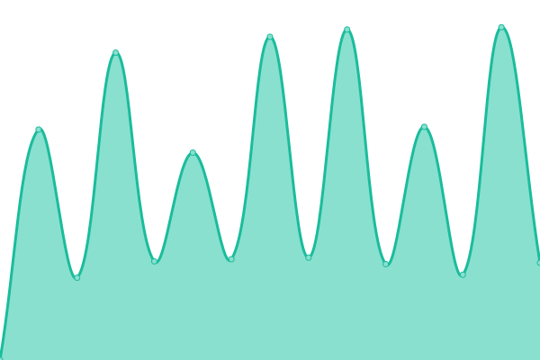

# [📈 Live Status](https://choipureum.github.io/ServerStatus): <!--live status--> **🟧 Partial outage**

This repository contains the open-source uptime monitor and status page for [PuReum Choi](https://blue-boy.tistory.com/), powered by [Upptime](https://github.com/upptime/upptime).

With [Upptime](https://upptime.js.org), you can get your own unlimited and free uptime monitor and status page, powered entirely by a GitHub repository. We use [Issues](https://github.com/choipureum/ServerStatus/issues) as incident reports, [Actions](https://github.com/choipureum/ServerStatus/actions) as uptime monitors, and [Pages](https://choipureum.github.io/ServerStatus) for the status page.

<!--start: status pages-->
<!-- This summary is generated by Upptime (https://github.com/upptime/upptime) -->
<!-- Do not edit this manually, your changes will be overwritten -->
<!-- prettier-ignore -->
| URL | Status | History | Response Time | Uptime |
| --- | ------ | ------- | ------------- | ------ |
|  실패 테스트 사이트 | 🟥 Down | [.yml](https://github.com/choipureum/ServerStatus/commits/HEAD/history/.yml) | 

 0ms
     
 | 

<a href="https://choipureum.github.io/ServerStatus/history/">0.00%</a>
    

|  [MBC_App_v4.5.1](https://m.imbc.com/wiz/mbcapp/v3/index.html?isAuto=Y) | 🟩 Up | [mbc-app-v4-5-1.yml](https://github.com/choipureum/ServerStatus/commits/HEAD/history/mbc-app-v4-5-1.yml) | 

 917ms
     
 | 

<a href="https://choipureum.github.io/ServerStatus/history/mbc-app-v4-5-1">100.00%</a>
    

|  [MBC_연말시상식 투표](https://program.imbc.com/Concept/2021ent) | 🟩 Up | [mbc.yml](https://github.com/choipureum/ServerStatus/commits/HEAD/history/mbc.yml) | 

 1733ms
     
 | 

<a href="https://choipureum.github.io/ServerStatus/history/mbc">100.00%</a>
    

|  [MBC_연기대상 투표](https://www.imbc.com/broad/tv/ent/template/2021mbc/drama/bestcouple/) | 🟩 Up | [mbc.yml](https://github.com/choipureum/ServerStatus/commits/HEAD/history/mbc.yml) | 

 1733ms
     
 | 

<a href="https://choipureum.github.io/ServerStatus/history/mbc">100.00%</a>
    

|  [MBC_control_API](https://control.imbc.com/App/V2/HomeTimeline) | 🟩 Up | [mbc-control-api.yml](https://github.com/choipureum/ServerStatus/commits/HEAD/history/mbc-control-api.yml) | 

 1463ms
     
 | 

<a href="https://choipureum.github.io/ServerStatus/history/mbc-control-api">100.00%</a>
    

|  [Olympic_API](https://control.imbc.com/WebApi/OlympicsRank) | 🟩 Up | [olympic-api.yml](https://github.com/choipureum/ServerStatus/commits/HEAD/history/olympic-api.yml) | 

 155ms
     
 | 

<a href="https://choipureum.github.io/ServerStatus/history/olympic-api">100.00%</a>
    

|  [Corona-19_API](https://control.imbc.com/WebApi/Covid19) | 🟩 Up | [corona-19-api.yml](https://github.com/choipureum/ServerStatus/commits/HEAD/history/corona-19-api.yml) | 

 181ms
     
 | 

<a href="https://choipureum.github.io/ServerStatus/history/corona-19-api">100.00%</a>
    

|  [랜덤_할일_생성기_v1.0](https://choipureum.github.io/todo-generator) | 🟩 Up | [v1-0.yml](https://github.com/choipureum/ServerStatus/commits/HEAD/history/v1-0.yml) | 

 106ms
     
 | 

<a href="https://choipureum.github.io/ServerStatus/history/v1-0">100.00%</a>
    

<!--end: status pages-->

[**Visit our status website →**](https://choipureum.github.io/ServerStatus)

## 📄 License

- Powered by: [Upptime](https://github.com/upptime/upptime)
- Code: [MIT](./LICENSE) © [PuReum Choi](https://blue-boy.tistory.com/)
- Data in the `./history` directory: [Open Database License](https://opendatacommons.org/licenses/odbl/1-0/)
